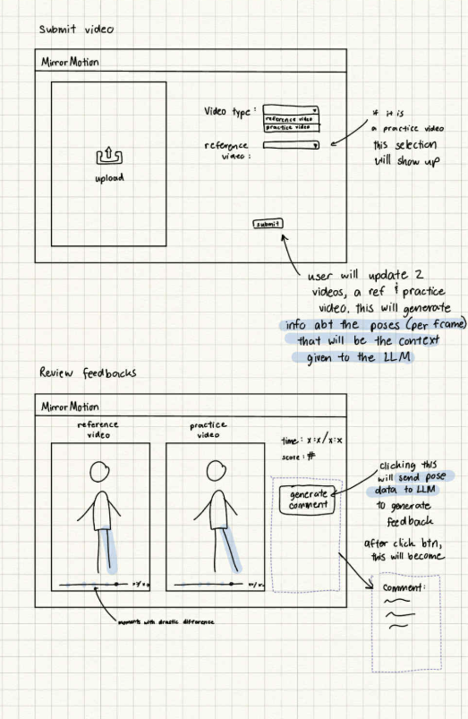

# AI-Augmented Concept Design and Evaluation

## **Original Concept Specification**
concept Feedback [PoseData]

purpose: highlight differences between practice video and reference choreography

principle: after a video is broken into different poses, we can generate feedback on different body parts

state
a set of Feedback with
- A feedbackID String
- A referencePoseData PoseData 
- A practicePoseData PoseData
- A feedback String
- A accuracyValue Number

actions
analyze(referencePoseData: PoseData, practicePoseData: PoseData): (feedbackID: String)
- requires: both PoseData exist
- effect: compares practice PoseData to reference PoseData, creates and stores Feedback

getFeedback(feedbackID: String): (feedback: String, accuracyValue: Number)
- requires: feedback with feedbackID exists
- effect: returns mismatched body parts with suggestions and accuracy score

---

## **AI-Augmented Version**
a set of Feedback with
- A feedbackID String
- A referencePoseData PoseData 
- A practicePoseData PoseData
- A feedback String
- A accuracyValue Number

actions
analyze(referencePoseData: PoseData, practicePoseData: PoseData, llm: GeminiLLM): (feedbackID: String)
- requires: both PoseData exist
- effect: compares practice PoseData to reference PoseData, and creates and stores new Feedback. Use LLM to interpret pose difference data, identify key areas for improvement, and generate natural-language coaching tips

getFeedback(feedbackID: String): (feedback: String, accuracyValue: Number)
- requires: feedback with feedbackID exists
- effect: returns mismatched body parts with suggestions and accuracy score

---

## **User Interaction Design**

### **Annotated Sketch Description**



### **User Journey**
The user begins by uploading both a reference and a practice dance video. The system automatically detects and extracts body landmarks and computes pose angle differences. Once processed, the user is shown side-by-side images of their movement compared to the reference. The user can click “Generate comment” and then the LLM will generate a personalized, encouraging feedback using pose data, with validators ensuring correctness and tone. If the feedback looks accurate and motivational, the user can confirm and save it. Otherwise, they can request another comment. Through this interaction, the user experiences a guided, supportive review process where the AI offers precise, trustworthy feedback while keeping the user in control.

---

---

## **Prompt and Test Case Experiments**

### **Initial Prompt**

```text
You are a professional dance or movement coach AI.
You are given differences between a reference choreography pose and a user's practice pose.

Analyze these angle differences and provide constructive, encouraging feedback
with clear instructions on how the user can improve their form.

DATA:
Accuracy Score: ${accuracyValue.toFixed(1)}%
Angle Differences:
${angleFeedback}
Angle Legend:
${limbConnectionsString}

Respond with a short, natural paragraph explaining:
1. Identify which body parts need adjustment based on the angle differences.
2. Suggest specific corrections to improve posture or motion.
3. Provide a motivational remark to encourage the user.
```

---

### **Test Case 1: Prioritizing Large Deviations**
Note: Very small angle difference, along with bigger difference

Scenario: The user submits a reference and practice video, and in one frame, one limb (left elbow to wrist) shows a large deviation while another limb (right elbow to wrist) shows a very small difference. The system calculates angles and sends the differences to the LLM. The AI should prioritizes the major difference, giving clear guidance on the left wrist/elbow while mostly ignoring the minor right elbow/wrist difference.

Prompt change: …
Analyze these angle differences and provide constructive, encouraging feedback
with clear instructions on how the user can improve their form.
Focus on the largest deviations in the user's pose and provide actionable corrective feedback. Minor deviations can be ignored.
DATA:...

Experiment Description: We created a test case where the left wrist was far inward while the right wrist was only slightly off. The original prompt seemed to automatically prioritize the larger deviation, and the AI focused on the left wrist/elbow while largely ignoring the minor right wrist difference. What worked: the system correctly highlighted the major movement. What went wrong: minimal, occasional mention of small deviations. Remaining issue: ensuring this behavior is consistent across more complex frames.

Orginial prompt response: Great work on achieving an 88% accuracy score! We're almost there! Looking at the angle differences, it seems your **left elbow** and **left wrist** are the primary areas needing a little attention. For the left arm, try to bring your left elbow slightly more forward, aligning it more directly under your shoulder. Then, ensure your left wrist is straight and extended, not bent inwards or outwards. Keep up this focused practice; you're doing wonderfully and will nail it with a little more refinement!

New prompt response: Great work on your practice session, your accuracy score of 88.0% shows you're really connecting with the choreography! The main adjustment needed is in your **left arm**. The angle difference of 45 degrees at your **left elbow** indicates it's likely too bent or extended compared to the reference. Try to consciously adjust the bend in your left elbow to match the reference pose more precisely, aiming for that specific angle. Keep up the fantastic effort; with this focused adjustment, your left arm will soon be as strong and precise as the rest of your movement!


---

### **Test Case 2: Handling Noisy/Outlier Landmarks**
Scenario: The user submits a reference and practice video, and in one frame, most limbs are aligned well, but one landmark (e.g., the right wrist) is missing or detected incorrectly due to occlusion or noise. The system calculates angles for all detected landmarks and sends the differences to the LLM. The AI should generate feedback based on the available reliable landmarks, noting uncertainty for the missing or noisy point, and avoid giving misleading guidance for the outlier.

Prompt Change:
```
...
Analyze the available angle differences and provide constructive, encouraging feedback. If any landmarks are missing or unreliable, mention this and focus feedback on the reliable data. Provide actionable instructions for the user while noting limitations due to missing points.
DATA: …
Reference Landmarks (PoseLandmark enum index order):
${JSON.stringify(refLandmarks)}
Practice Landmarks (PoseLandmark enum index order):
${JSON.stringify(practiceLandmarks)}
PoseLandmark enum for reference:
${poseEnumString}
Have a concise note on potential landmark detection issues at the end:
If there is a landmark coordinate that is extremely different from other coordinates
in that pose, highlight it as a potential mis-detection of the joint. DO NOT attempt
to give any feedback on any angle involving that joint.
...
```

Experiment Description: We created a test case where one landmark (the right wrist) was unreliable, with an extreme x,y coordinate, while other joints were mostly accurate. The original prompt didn’t account for the actual coordinate values and only considered angles. With the updated prompt, the AI correctly focused on the reliable landmarks and acknowledged the uncertainty for the outlier joint. What worked: the system provided actionable feedback for the left arm and other visible joints. What went wrong: without careful prompting, the AI occasionally attempted to give feedback on the misdetected landmark. Remaining issues: ensuring consistent handling of multiple unreliable points across frames and determining a proper threshold for identifying incorrectly detected landmarks.

Orginial prompt response: Hey there! You're making great progress, and with a few tweaks, we can get you even closer to that perfect pose. The biggest adjustments needed are with your **left elbow and wrist**, and also your **right elbow and wrist**. For the left side, it looks like your arm is bent quite a bit more than in the reference, so try to straighten your left arm a little, focusing on extending from the shoulder through the wrist. For your right arm, the angle suggests a significant bend, so aim to open up that angle by extending your right arm more from the shoulder down to the wrist. Keep up the fantastic effort; you're so close to nailing this!

New prompt response:Great effort on this pose! We're seeing some good alignment in several areas. Let's focus on refining your left arm. It looks like your left elbow is a bit too far out and your left wrist is angled lower than the reference. Try to bring your left elbow closer to your body and lift your left wrist up so it aligns more with your left elbow and shoulder. You're doing a fantastic job, keep pushing forward! Potential landmark detection issue: The right wrist coordinate [-95,302] seems unusually far from the other landmarks. This might be a detection error.

---

### **Test Case 3: Missing Landmarks**

Scenario: The user submits a reference and practice video, and in one frame, all limbs are mostly aligned except the right wrist, which is either missing or has an extreme (noisy) coordinate. The system calculates angles for the available landmarks and sends the differences to the LLM. The AI should focus on the reliable landmarks and acknowledge uncertainty for the outlier or missing joint.

Prompt Change: added "2. If an angle is NaN, it means one of the joints involved in that angle is missing. Mention the specific missing joints using the LimbConnections and PoseLandmark enum reference."

Experiment Description: We created a test case where one landmark (the right wrist) was completely missing, while all other joints were mostly accurate. The system calculated angles for the available landmarks and marked any angles involving the missing joint as NaN. With the updated prompt instructing the AI to reference LimbConnections and the PoseLandmark enum for missing joints, the AI generated feedback only for reliable joints and acknowledged that the right wrist was missing. What worked: the AI correctly ignored the missing joint when giving corrective guidance and provided actionable feedback for the visible limbs. What went wrong: in some cases, the AI still attempted to comment on the missing joint if the prompt was slightly ambiguous. Remaining issues: ensuring consistent handling when multiple joints are missing in a frame, and establishing a robust approach for detecting and reporting missing coordinates across all frames.

Orginial prompt response: You're doing a fantastic job, and your accuracy score of 88.8% shows that you're really close to  nailing this pose! Based on the data, your left wrist (connected to your left elbow and left shoulder) is the main area that needs a slight adjustment. Specifically, the angle between your left shoulder and left elbow is off by 45 degrees. To correct this, focus on bringing your left elbow closer to your body, as if you're hugging yourself with that arm. Imagine keeping your upper arm in line with your torso and then bending your elbow from there. You're almost there, so keep up the great work and trust your practice! 
**Potential Landmark Detection Issues:** There are no obvious outlier landmarks in this pose.

New prompt response: Great job on your practice! You're looking strong with an 85% accuracy score. We'll focus on refining a couple of areas to get you even closer to the reference.
It appears your **left arm** needs a little adjustment. The connection from your left shoulder to your left elbow (angle 1) is showing a significant difference. To improve this, try to actively bring your left elbow a bit further back, aligning it more directly with your left shoulder. This will help create the intended line in your pose.
Keep up the fantastic work! You're making excellent progress and with a little fine-tuning, you'll be nailing this pose in no time.
**Potential Landmark Detection Issues:**
Angle 3 (RIGHT_SHOULDER to RIGHT_ELBOW) resulted in NaN, indicating that either the RIGHT_SHOULDER or RIGHT_ELBOW landmark was not detected in your practice pose. Please ensure these joints are clearly visible.

---

## **Validators and Error Handling**
Three plausible issues were identified and addressed with validators. (1) Hallucinated landmarks: the LLM may reference joints that don’t exist in the PoseLandmark enum. To prevent this, the validateExistingLandmarks() function parses all mentioned joints from the LLM’s feedback and throws an error if any are invalid. (2) Negative or discouraging tone: since feedback should always be constructive but positive, we use a mood-checking prompt to ensure that the response remains positive and encouraging. If not, a warning is issued for review. (3) Verbose or unfocused responses: long or repetitive feedback can overwhelm users. The system counts the number of words in the generated feedback and issues a warning if it exceeds 500 words, ensuring conciseness and clarity. Together, these validators maintain accuracy, tone quality, and readability in the AI-generated feedback.
